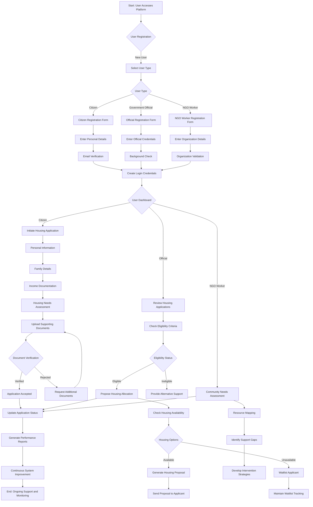

# SwaGhar

A comprehensive platform for managing housing applications and allocations, connecting citizens, government officials, and NGO workers in a streamlined process.

## Overview

Urban areas face significant challenges due to the lack of affordable housing, resulting in:

Growth of slums and homelessness
Absence of transparent land records
Inefficient housing allocation
Limited access to government support programs
Inadequate infrastructure for basic needs

Urban areas face critical challenges due to a lack of affordable housing, resulting in the proliferation of slums and homelessness, compounded by issues such as non-transparent land records, inefficient housing allocation, limited access to government support programs, and inadequate basic infrastructure for sanitation, food, and healthcare. These interconnected problems perpetuate a cycle of poverty, unemployment, and poor living conditions among vulnerable populations. Our solution aims to tackle these challenges through a comprehensive, technology-driven approach that ensures transparent land management, efficient resource allocation, and seamless access to essential services and government initiatives. By leveraging innovative technologies and scalable frameworks, our solution strives to uplift urban communities, reduce homelessness, and create sustainable living environments that improve quality of life and break the cycle of urban poverty


## System Architecture

The following flowchart illustrates the complete workflow of our Housing Management System, including user registration, application processing, and monitoring:




### Key Features

#### User Management
- Multi-role user registration system
- Role-based access control
- Secure authentication and authorization
- Email verification system

#### Citizen Portal
- Housing application submission
- Document upload system
- Application status tracking
- Real-time updates and notifications
- Personal dashboard

#### Official Dashboard
- Application review interface
- Eligibility assessment tools
- Housing allocation management
- Document verification system
- Waitlist management

#### NGO Worker Interface
- Community needs assessment
- Resource mapping tools
- Support gap analysis
- Intervention planning

## Technical Stack

### Frontend
- React.js
- Tailwind CSS
- Shadcn/ui components
- Lucide Icons
- React Router for navigation

### Backend
- Node.js
- Express.js
- MongoDB
- JWT for authentication
- Multer for file uploads

### Security Features
- JWT-based authentication
- Role-based access control
- Document encryption
- Secure file storage
- Input validation and sanitization

## Getting Started

### Prerequisites
- Node.js (v14 or higher)
- MongoDB
- npm or yarn

### Installation

1. Clone the repository
```bash
git clone https://github.com/Samrudhp/SwaGhar.git
cd housing-management
```

2. Install dependencies
```bash
# Install frontend dependencies
cd client
npm install

# Install backend dependencies
cd ../server
npm install
```

3. Configure environment variables
```bash
# In the server directory, create a .env file
cp .env.example .env
```

4. Start the development servers
```bash
# Start backend server
cd server
npm run dev

# In a new terminal, start frontend
cd ..
npm run dev
```


## API Documentation

The system provides RESTful APIs for:
- User management
- Application processing
- Document management
- Housing allocation
- Notification system


## Contributing

1. Fork the repository
2. Create your feature branch (`git checkout -b feature/AmazingFeature`)
3. Commit your changes (`git commit -m 'Add some AmazingFeature'`)
4. Push to the branch (`git push origin feature/AmazingFeature`)
5. Open a Pull Request

## Security Considerations

- All sensitive data is encrypted at rest
- File uploads are validated and scanned
- Regular security audits are performed
- Rate limiting is implemented on all APIs
- Input validation on all forms

## Future Enhancements

- Mobile application
- Real-time chat support
- Integration with government databases
- Advanced analytics dashboard
- Blockchain-based document verification

## License

This project is licensed under the MIT License - see the LICENSE.md file for details

## Contact

Your Name - samrudhprakash3084@gmail.com
Project Link: https://github.com/Samrudhp/SwaGhar-

## Acknowledgments

- Government Housing Department
- Local NGO Partners
- Community Support Groups
